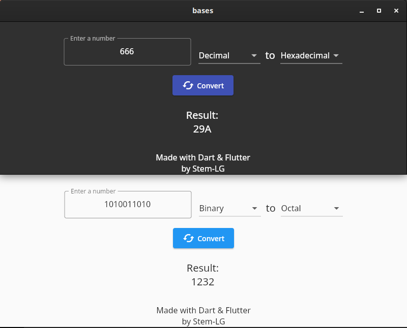

# bases

An app to convert between numerical bases.

preview:

you can find built packages in the releases tab ("as soon as a stable enough version exists")

future additions:
"desktop":
-window size control
"other":
-input control
-more bases support ("maybe custom bases with custom characters too")
-Roman numerals support

Built using Dart & Flutter :)
